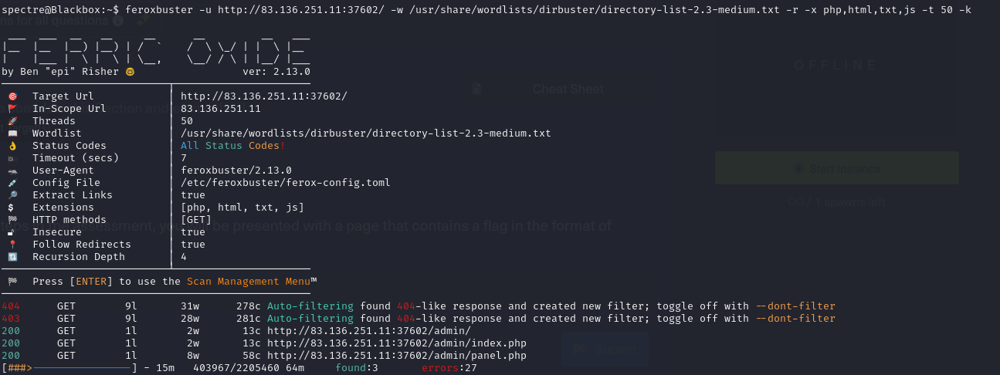
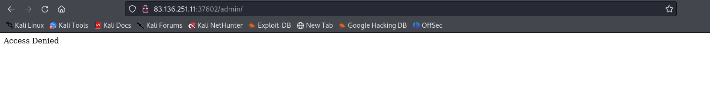
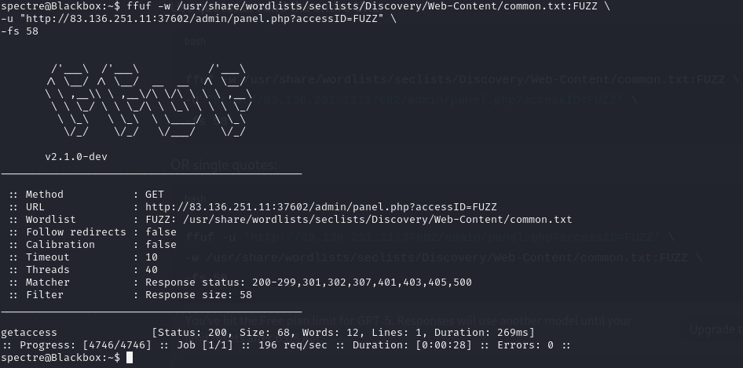
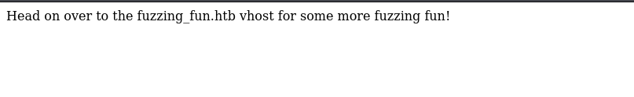
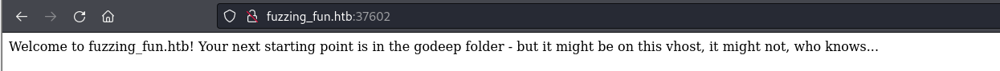
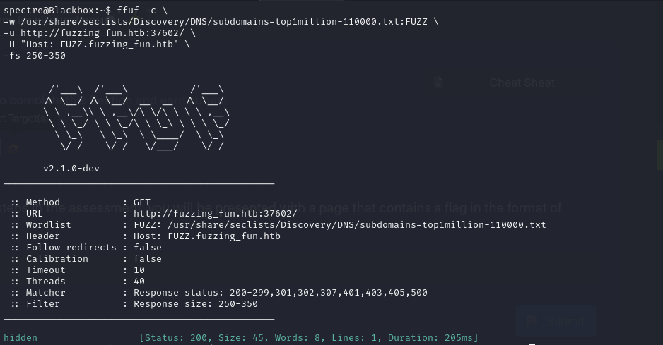
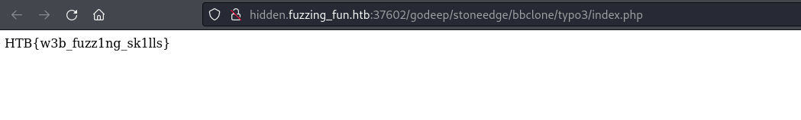

**1 — Initial Surface Mapping (Feroxbuster)**
I started with a quick recursive mapping using feroxbuster to identify accessible paths on the target.

The scan immediately revealed two high-value directories:

/admin

/admin/panel.php

These paths were prioritized because administrative endpoints often expose useful parameters or access control mechanisms.

**2 — /admin Access Control Confirmed**

Opening /admin returned a simple:

Access Denied.

This confirmed that:

The path exists,

Access control is in place,

It is worth enumerating further.

**3 — /admin/panel.php Reveals a Parameter (accessID)**

Accessing /admin/panel.php displayed an error mentioning:

Invalid parameter… accessID

Whenever a page references a parameter by name, it’s often a sign that fuzzing the parameter may trigger alternative logic or responses.

**4 — Parameter Fuzzing accessID → Found “**getaccess**”**

I fuzzed the accessID parameter with ffuf:

This revealed: getaccess

Accessing it returned a hint instructing me to visit a virtual host:
Go to **fuzzing_fun.htb**

This was the key moment: The site was virtual host–based, meaning the correct Host header was required.

**5 — Adding fuzzing_fun.htb to /etc/hosts**

To make the virtual host resolve correctly, I added it manually:
**sudo nano /etc/hosts**

This allowed the server to respond with the content intended for that hostname.

The page provided two new hints:

The next step is in the /godeep directory.

It “might be on this vhost,” hinting at subdomains.

**6 — Subdomain Fuzzing → Found hidden**

I fuzzed for Subdomain using ffuf:

Then added it to /etc/hosts:

**7 — Hint Points to /godeep**

Visiting the new subdomain displayed another message pointing specifically to: /godeep

This validated that the final content was nested deeper within this vhost.

**8 — Recursive Fuzzing Inside /godeep**

With the correct vhost and path in place, I ran a deeper feroxbuster scan:

This recursion uncovered multiple nested directories and files—one of which contained the final flag.

**9 — Final Flag Obtained 🎉**
Inside the discovered directory, the flag appeared:

